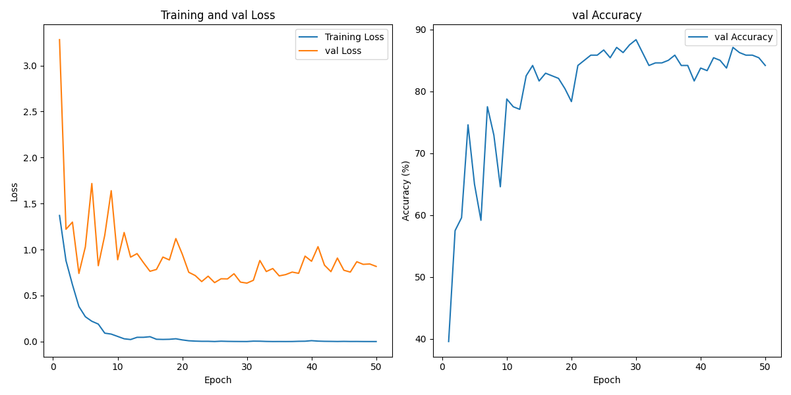
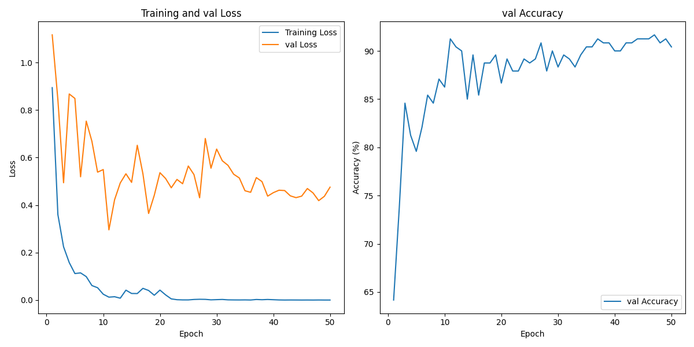

新能源汽车图像分类 - ClassifySI 框架实践

区分 Taycan、WeiLai_ET7、XiangJie_S9、XiaoMi_SU7、XiaoPeng_P7、ZhiJie_S7 六类汽车图片。

### 准备

在 Ubuntu 18.04.6 LTS 平台，使用 python=3.8，torch\==1.12.1+cu113，torchvision==0.13.1+cu113，cuda=11.3，训练设备使用 TitanXp（12GB）

数据集：[下载地址](https://pan.baidu.com/s/1yTtzhyM1w4bk2Eq0IrX0pg?pwd=q33i)

_[ 已训练模型权重等 CheckPoint：[下载地址](https://pan.baidu.com/s/1uk6vAPTNtdxYQXQy6v_NEQ?pwd=xecn) ]_

共 6 类汽车图片，每类汽车 200 张，共计 1200 张。

```bash
python dataAugmSplit.py -raw ../../dataset-tmp/car -out ./data
```

-raw 指定好解压后的数据集位置，其它均使用了默认参数(prob_aa=0.45)。

`dataAugmSplit.py` 将数据集先划分为了 8：1：1，即每类图片划分为 160：20：20.划分使用`train_test_split()`，随机种子固定为`random_state=42`。对训练集增强 3 次，验证集增强 1 次。最后训练集共计 $`160\times(3+1)\times 6=3840`$ 张图片，验证集共计 $`20\times(1+1)\times 6=240`$，测试集共计 $`20\times 6=120`$ 。

<div align="center">
  
</div>

### 训练

#### ResNet-18

```python
# ResNet
from torchvision.models import ResNet18_Weights
class Classifier(nn.Module):
    def __init__(self, num_classes):
        super(Classifier, self).__init__()
        self.resnet = models.resnet18(weights=ResNet18_Weights.IMAGENET1K_V1)
        num_features = self.resnet.fc.in_features
        # 替换原始的全连接层
        self.resnet.fc = nn.Identity()  # 用一个恒等映射替换原始的全连接层
        self.fc1 = nn.Linear(num_features, 128)
        self.fc2 = nn.Linear(128, num_classes)

    def forward(self, x):
        x = self.resnet(x)
        x = self.fc1(x)
        x = torch.relu(x)
        return self.fc2(x)
```

```bash
python train.py -g 1 -sd 1024
```

使用单卡训练，默认 50epochs，固定随机数种子为 1024，使用默认批次大小 default=[32, 1]。TitanXp 共耗时 2h 左右，训练时占用显存 4800MB 左右。训练 log 如下所示：

<div align="center">
  
</div>

训练曲线如下所示：

<div align="center">
  
</div>

将保存的模型权重`save_model/model.pth`重命名为`save_model/model_resnet.pth`

#### MobileNetV2

```python
# MobileNetV2
from torchvision.models import mobilenet_v2, MobileNet_V2_Weights
class Classifier(nn.Module):
    def __init__(self, num_classes):
        super(Classifier, self).__init__()
        self.model = models.mobilenet_v2(weights=MobileNet_V2_Weights.IMAGENET1K_V1)
        self.model.classifier[1] = nn.Linear(self.model.last_channel, num_classes)

    def forward(self, x):
        return self.model(x)
```

```bash
python train.py -g 1 -sd 1024
```

使用单卡训练，默认 50epochs，固定随机数种子为 1024，使用默认批次大小 default=[32, 1]。TitanXp 共耗时 2h 左右，训练时占用显存 11700MB 左右。训练 log 如下所示：

<div align="center">
  
</div>

训练曲线如下所示：

<div align="center">
  
</div>

将保存的模型权重`save_model/model.pth`重命名为`save_model/model_mobilenet.pth`

### 测试

#### ResNet-18

```bash
python test.py -m ./save_model/model_resnet.pth
```

使用 TitanXp 进行测试，测试结果如下所示：

<div align="center">
  
</div>

输出的模型准确率 Accuracy、F1 Score，各类精确率 Precision、召回率 Recall、特异度 Specificity、F1 Score，模型参数量，推理速度如下所示：

<div align="center">
  
</div>

将保存的整个模型文件`save_model/model_all.model`重命名为`save_model/model_all_resnet.model`

#### MobileNetV2

```bash
python test.py -m ./save_model/model_mobilenet.pth
```

使用 TitanXp 进行测试，测试结果如下所示：

<div align="center">
  
</div>

输出的模型准确率 Accuracy、F1 Score，各类精确率 Precision、召回率 Recall、特异度 Specificity、F1 Score，模型参数量，推理速度如下所示：

<div align="center">
  
</div>

将保存的整个模型文件`save_model/model_all.model`重命名为`save_model/model_all_mobilenet.model`

导入[Netron](https://github.com/lutzroeder/netron)中进行可视化：

|            |                                ResNet-18                                |                                  MobileNetV2                                  |
| :--------: | :---------------------------------------------------------------------: | :---------------------------------------------------------------------------: |
| 带权重参数 | [model_all_resnet_weight.png](./save_model/model_all_resnet_weight.png) | [model_all_mobilenet_weight.png](./save_model/model_all_mobilenet_weight.png) |
|  不带参数  |        [model_all_resnet.png](./save_model/model_all_resnet.png)        |        [model_all_mobilenet.png](./save_model/model_all_mobilenet.png)        |

---

为探究数据增强部分 AutoAugment 策略和中心最大化裁剪`CenterCrop`对模型分类性能的影响，采用对比实验，分别使用 0%、45%、100%三种增强比例对数据集进行增强。划分时`train_test_split()`固定随机种子`random_state=42`。其它参数使用默认值。

```bash
python dataAugmSplit.py -out ./data_0 -p 0.
```

```bash
python dataAugmSplit.py -out ./data_45 -p 0.45
```

```bash
python dataAugmSplit.py -out ./data_1 -p 1.
```

对于两个模型训练时都将随机数种子`-sd`固定为 1024 训练和测试。

测试结果如下：

train_w 表示在[train.py](https://github.com/Giperx/ClassifySI/blob/11392bd53e3ad854d81098183a4249d1247c1321/train.py#L55)和中`get_transforms()`函数中使用了`CenterCrop`，先进行中心化最大裁剪为正方形；train_wo 表示训练时未使用`CenterCrop`。

test_w 表示在[test.py](https://github.com/Giperx/ClassifySI/blob/501d642e6f62328c779fdceeb8aceab31f7da8bd/test.py#L51)测试时使用了`CenterCrop`；test_wo 表示测试时未使用`CenterCrop`。

- ```python
  def get_transforms():
      # Define image transformations
      CenterCrop = transforms.Lambda(lambda image: center_crop(image))
      transform = transforms.Compose([
          CenterCrop, # max Center crop
          transforms.Resize((448, 448)),
          transforms.ToTensor(),
          transforms.Normalize((0.485, 0.456, 0.406), (0.229, 0.224, 0.225))
      ])
      return transform
  ```

| prob_aa | train | test | ResNet-18 | MobileNetV2 |
| :-----: | :---: | :--: | :-------: | :---------: |
|    0    |  wo   |  wo  | **92.5**  |  **96.7**   |
|    0    |  wo   |  w   |   90.0    |    93.3     |
|    0    |   w   |  wo  |   90.0    |    95.0     |
|    0    |   w   |  w   | **92.5**  |    95.0     |

| prob_aa | train | test | ResNet-18 | MobileNetV2 |
| :-----: | :---: | :--: | :-------: | :---------: |
|   45    |  wo   |  wo  | **93.3**  |  **95.8**   |
|   45    |  wo   |  w   | **93.3**  |    92.5     |
|   45    |   w   |  wo  |   88.3    |    90.0     |
|   45    |   w   |  w   |   89.2    |    95.0     |

| prob_aa | train | test | ResNet-18 | MobileNetV2 |
| :-----: | :---: | :--: | :-------: | :---------: |
|    1    |  wo   |  wo  | **90.1**  |  **94.2**   |
|    1    |  wo   |  w   |   88.3    |    90.8     |
|    1    |   w   |  wo  |   90.0    |    90.0     |
|    1    |   w   |  w   |   90.0    |    92.5     |
